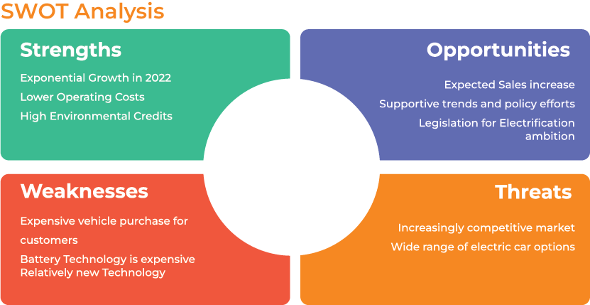

# Project title: Ecomotion

## Introduction:
The project aims to explore the EV market and estimate depreciation of EVs in order to give recommendations regarding the GUV fidelity program. 

The objectives of the project are as follows:

• Analysing the EV market and determining the retail price of different models.
• Estimating the depreciation of electrical vehicles.
• Assessing the sustainability of the loyalty program and providing recommendations.

## SWOT Analysis:

## Experimental Design
### Feature Engineering:
• To leverage our dataset as much as possible, we extracted new features from the artists and genre columns. This enabled us to use make use of both variables and deal with the challenge of having to encode them later on which wasn't an option given that the columns had way too many classes to encode. Therefore, we extracted Artist_influence and Genre_influence tracks where we stored the average Popularity for each artist and genre respectively.
• We conducted NLP on album names to see if it's possible to conduct topic modeling on the album_name feature. This helped us discover that a lot of our albums were actually playlists or soundtracks. We extracted 2 new binary variables for Playlist and Soundtrack to explore them separately.
• We also extracted a new feature called 'Featuring' that takes as values True if the track has more than one artist and False otherwise.

### Clustering:
To see if it's possible to identify different genres with a clustering algorithm, we used k-means with k=114. We then evaluated our clustering results using ARI to measure the degree of alignment between the k-means output and the Genre column.

### Models:
The main thing we noticed when we were building the model (mostly thanks to the correlation matrices we produced) is that artist popularity is the biggest factor for determining the popularity of a track which we thought would hinder us from extracting any useful findings from the models. For this reason, we decided to build models with 2 different approaches: The first one includes all the dataset (post-processed data) and the second approach filters out the very popular tracks from the dataset to reach a threshold that minimizes the correlation between artist_influence and popularity (we chose popularity < 10 after visualizing correlation matrices with different potential thresholds).
The different algorithms we used are Linear Regression, Random Forest, and XGBoost. For the 2nd approach, we also tried using an ANN.

To evaluate the models we looked at MSE, RMSE, and R-squared.

## Results:

## Conclusions:

• Audio features are not sufficient in predicting popularity due to their overlap across different tracks and genres.
• Genre is the most important predictor of popularity outside of Artist influence.
• The most popular genres used in soundtracks are pop-film, disney, and k-pop.
• The most popular genres added to playlists are jazz, soul, and rock.
• Less popular tracks tend to be added to more playlists for marketing purposes.
• Up and coming artists should be inclined to produce pop-film, chill, or sad
songs