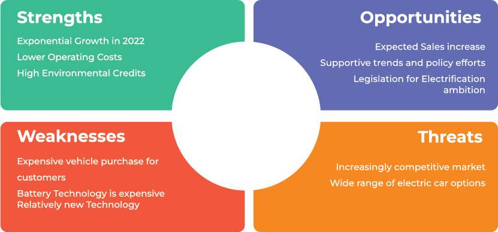
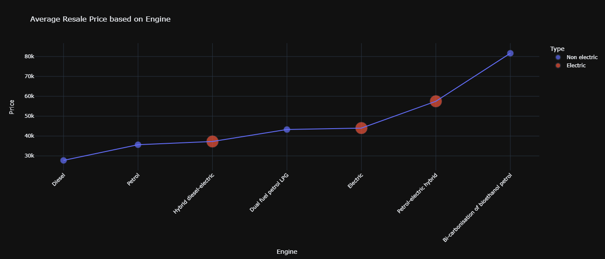
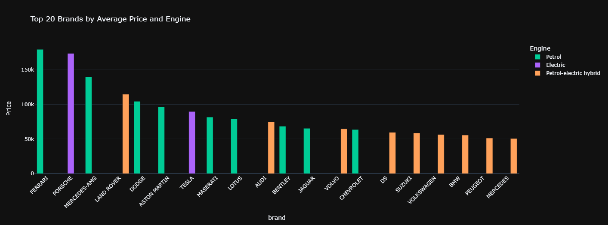
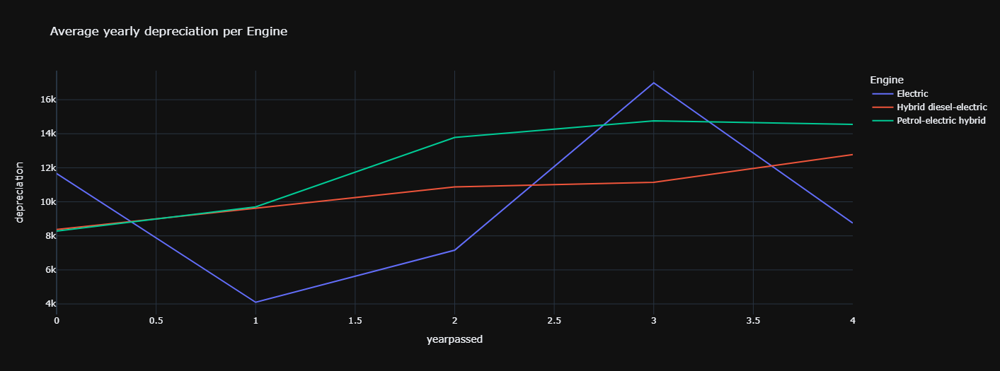
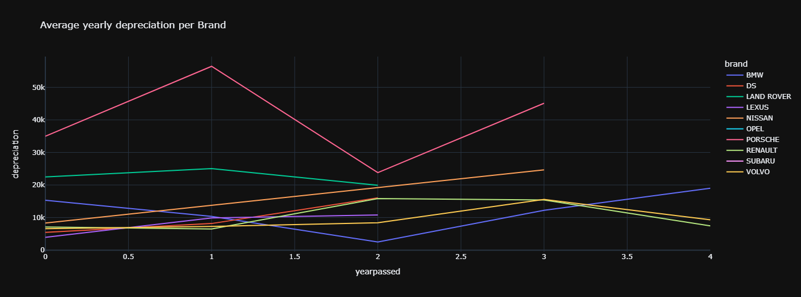
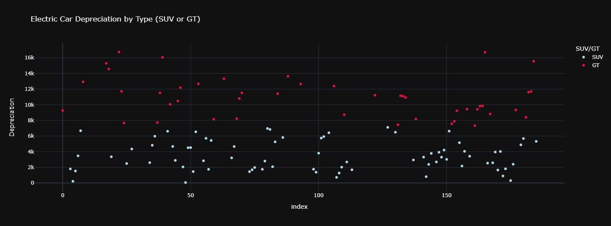
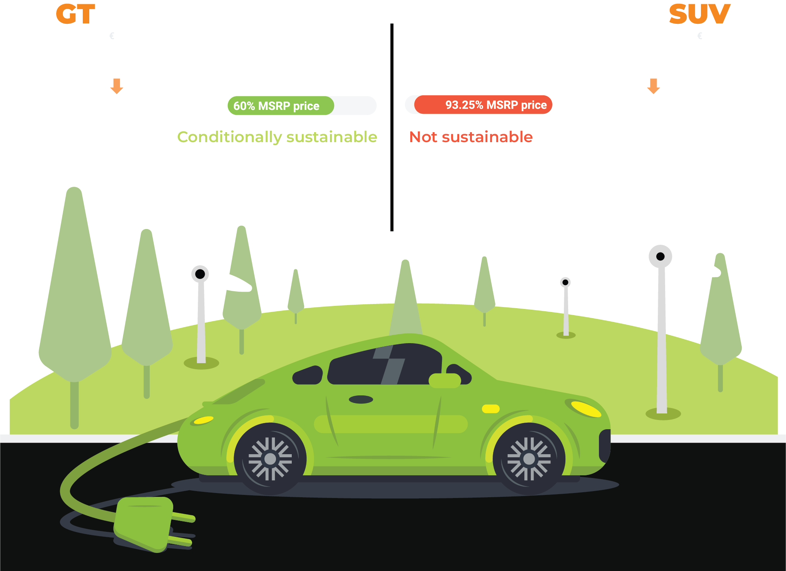

# Project title: Ecomotion

## Introduction:
The project aims to explore the EV market and estimate depreciation of EVs in order to give recommendations regarding the GUV fidelity program. 

The objectives of the project are as follows:

• Analysing the EV market and determining the retail price of different models.
• Estimating the depreciation of electrical vehicles.
• Assessing the sustainability of the loyalty program and providing recommendations.

## SWOT Analysis:

## Exploring Engine Resale prices

## Exploring Resale prices by brand

## Exploring Engine depreciation

## Exploring Brand depreciation

## Clustering the data based on depreciation in order to develop separate action plans for GT and SUV cars

## Action Plan: GUV Program

